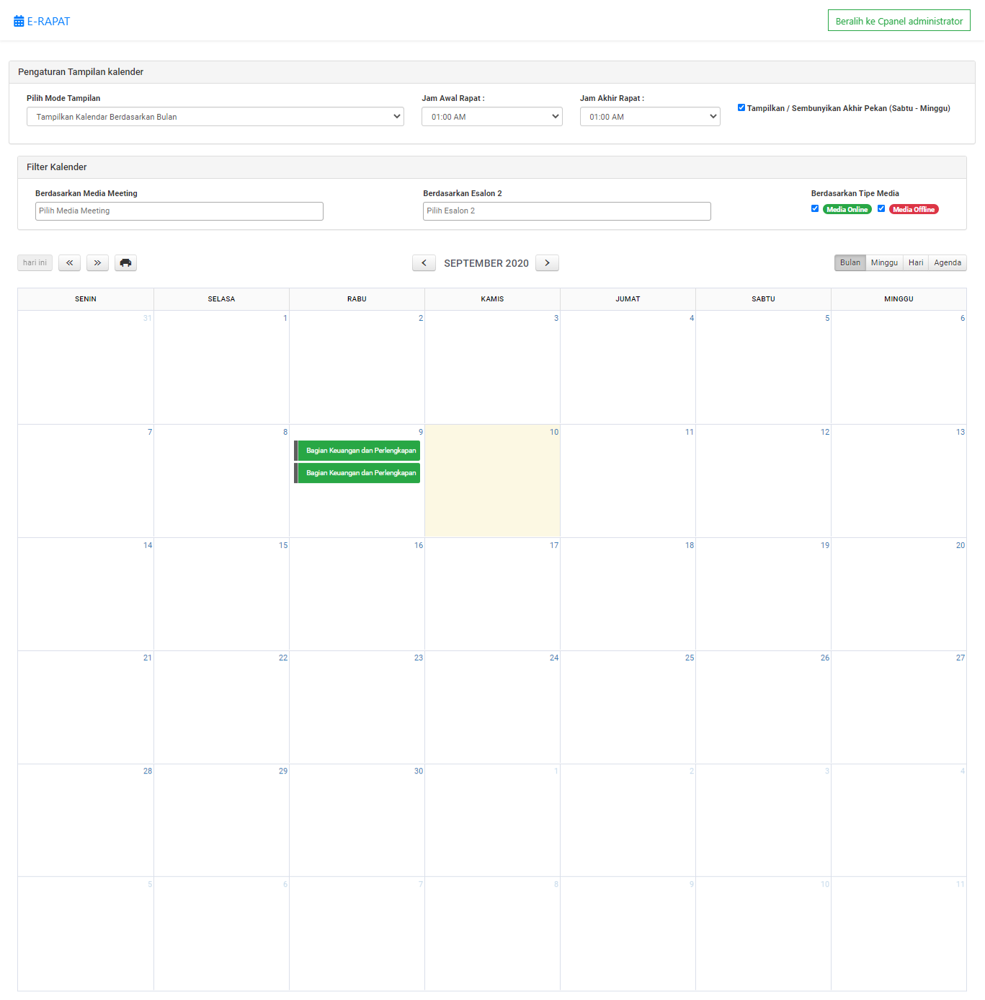
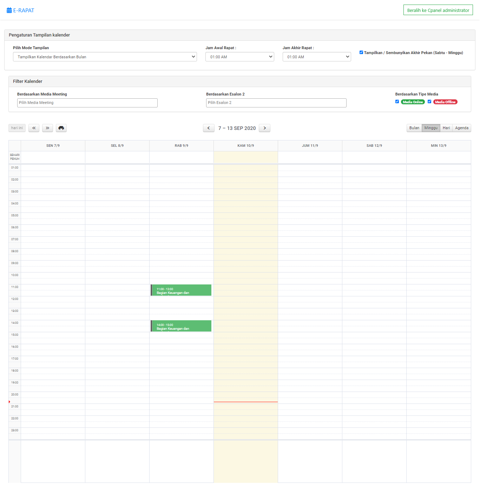
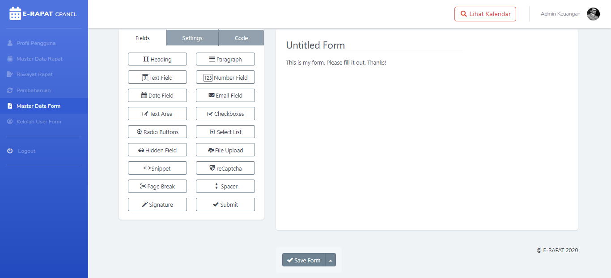
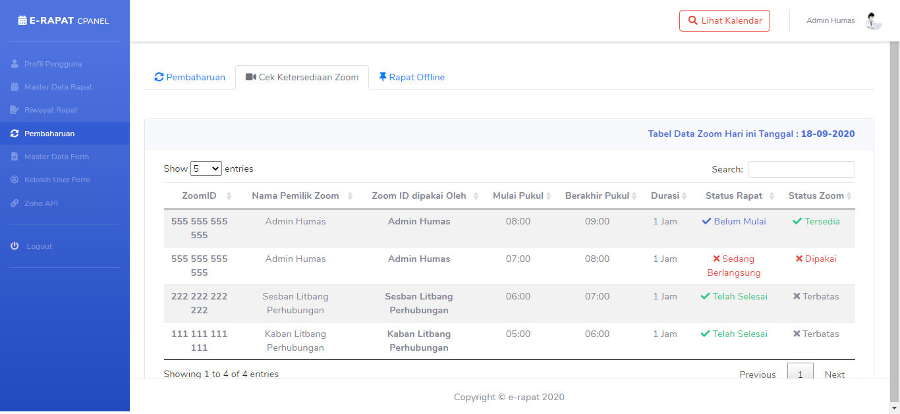

## E-RAPAT version 1 (Old Legacy)

### About

E-RAPAT version 1 (Old Legacy) is the Legacy Application for Meeting Administration in Research & Development Center, Ministry of Transportation of the Republic of Indonesia.
Now this application is `Release candidate`, Nowdays we still on progress develop, but if you want to contribute, please let me know.

### Getting Started

If you want to play around with this application, just clone it by typing :
`git clone https://github.com/ivandi1980/e-rapat.git`
or click the green button on top right of this list of repo's file.

you maybe can faced many branch on this repo because every change or updates happening within branch. but after testing then the correct codes will always mergeing into `Master` Branch.

## i'm not sure it would be stable, but we would be updates daily.

`This Documentation would be update regularly` Beacuse this Project is still On `DEVELOPMENT PHASE`

---

### Changelog

The following is the development version of `e-rapat application`

* ~~Alpha Version 0.0.0~~ - June 2020
* ~~Beta Version 1.0.0~~ - July 2020 - August 2020
* **Release candidate 2.0.0** - September 2020

### The Screenshoot

Here is the screenshoot of the application.

